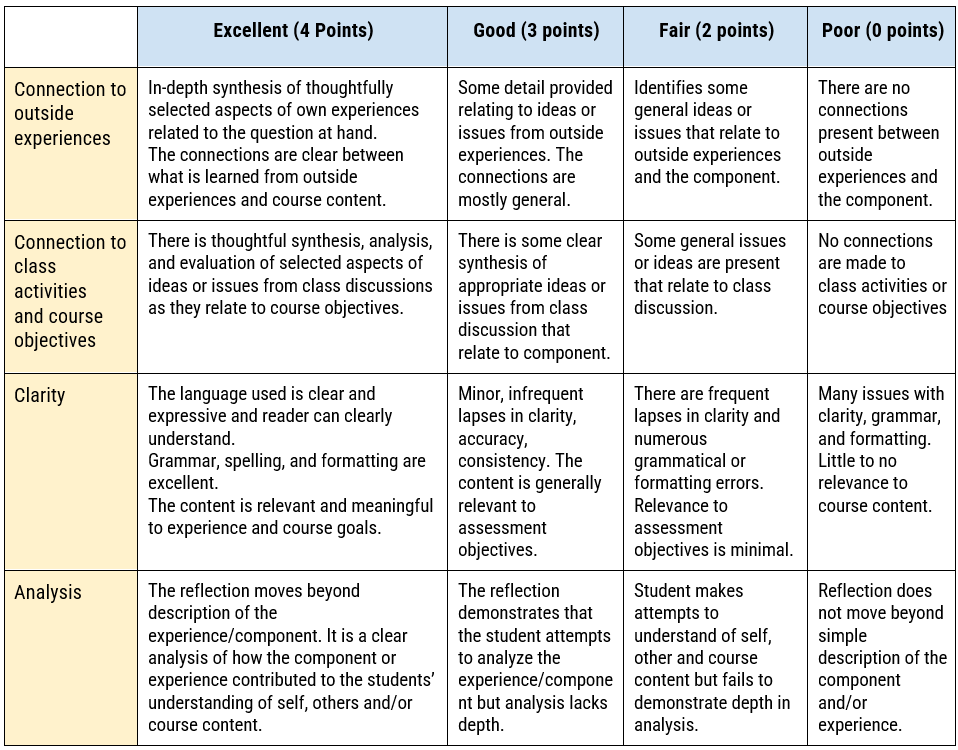

# Reflection #1
iSci 3A12 - Climate Change – Fall 2024  

|Date Assigned|2024-09-16|
|:--|:--|
|**Date Due**|**2024-09-22**|
|**Weight**|**2 points**|

Your first reflection assignment is a direct response to the questions you were asked on the first day of the project:
- What are your personal thoughts and understanding of climate change?
- What (if anything) concerns you about climate change?
- What should you (and we) do about it?
- What do you hope to gain from this project?
- What do you want to learn?

Your reflection should have an **absolute maximum of 500 words** that express your thoughts/feelings/ideas regarding the questions posed above. Effective reflections are a synthesis of your thoughts/feelings/ideas/knowledge regarding an experience (e.g., discussion, experiential learning opportunity, lecture, etc.) and how that may support, change, or redefine your perspective on the issue or question at hand.  

Reflections will be evaluated out of a total of 16 points using the following rubric: 

