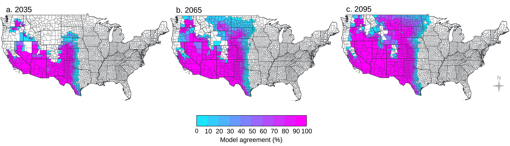

# A Perfect Fungal Storm: The Impact of Climate Change on Fungal Infections in Humans
**By Alexandra Biernacki, Ben Mazin, Claire Rintoul, & Sam Vanhaverbeke**

## Introduction
As the climate changes, increasing global temperatures and extreme weather are not the only concerns (Ikuta et al. 2022). Fungal pathogens sit mere degrees below our current body temperature, waiting to infect our bodies. As the climate warms, the temperature barrier that protects humans is shrinking as fungi evolve to survive in warmer conditions. Ultimately, this means fungal pathogens are on the rise and humans are increasingly at risk with approximately 3.75 million people killed every year (Dall 2024). Climate change is also allowing fungi to grow in areas of the world that would previously be unsuitable, while simultaneously causing increasing resistance to antifungal treatments.

## Thermal Barrier

All species are constantly under attack by pathogens, without a mechanism to defend themselves, species would not survive. One way that mammals protect themselves is through body temperature, a defence referred to as the thermal exclusion zone (Bergman and Casadevall 2010). This defence is effective against fungi as they typically begin to break down and die when temperatures are greater than 30°(Leach and Cowen 2013; Robert and Casadevall 2009). Although, as climate change creates selective pressure for fungi to evolve to live in warmer climates, they will also be able to survive the higher temperatures of the human body and cause infection (Casadevall and Garcia-Solache 2010).

## Fungi Spread

Climate change is also allowing fungi to grow in areas of the world that would previously be unsuitable, which is resulting in increased fungal pathogen outbreaks. For example, the range of Valley fever is expected to double by 2100, as rising temperatures make soils across the United States the ideal environment for growth (Figure 1) (Konkel Neabore 2024). Rising temperatures are causing fungi to become more temperature tolerant, which is causing outbreaks of *Aspergillus fumigatus* to increase, threatening immunocompromised individuals. These pathogen outbreaks are particularly concerning as climate change is only expected to further increase temperatures, allowing fungi to spread across the globe.

  
   
  <em>Figure 1: The projected spread of Valley fever (Coccidioidomycosis) across the United States due to climate change for the years 2035, 2065, and 2095. The fungus grows in dirt and soil, with wind picking up particles and transporting them to new areas. Climate change is expected to cause drier and hotter environments, along with higher frequency of extreme weather events, allowing the fungus to spread and thrive in new locations. By 2095, it is likely that Valley fever will extend to the northern perimeter of the United States (Gorris et al. 2019).</em>

## Antifungal Medication and Climate Change

While turning to antifungal medications may seem like the quick fix for increasing fungal infections, changing climate is also resulting in increasing levels of antifungal resistance (George et al. 2025; Berger et al. 2017). This is primarily attributed to the increasing need for antifungals in agriculture as climate change leaves crops susceptible to infection. The heightened use of agricultural antifungals results in fungi developing resistance, and given the similarity between human and crop antifungals, decreases the efficacy of drugs used in clinical settings. This is already playing out with strains of *Aspergillus fumigatus* where treatments are being ineffective and will only continue to worsen as climate change progresses  (van de Veerdonk et al. 2025).

## Conclusion

As established, climate change, with its increasing temperatures and severe weather events, is allowing fungi to bypass human’s thermal barrier, expand to regions not thought possible, and gain resistance to our medications. Given climate change is only expected to get worse we are heading into a perfect storm where fungi thrive, at our expense.

## References
Berger, Sarah, Yassine El Chazli, Ambrin F Babu, and Alix T Coste. 2017. “Azole Resistance in Aspergillus Fumigatus: A Consequence of Antifungal Use in Agriculture?” *Front. Microbiol.* 8 (June): 1024. https://doi.org/10.3389/fmicb.2017.01024. 

Bergman, Aviv, and Arturo Casadevall. 2010. “Mammalian Endothermy Optimally Restricts Fungi and Metabolic Costs.” *mBio* 1 (5): e00212-10. https://doi.org/10.1128/mBio.00212-10. 

Casadevall, Arturo, and Monica A. Garcia-Solache. 2010. “Global Warming Will Bring New Fungal Diseases for Mammals.” *American Society For Microbiology,* ahead of print, May 18. https://doi.org/10.1128/mBio.00061-10. 

Dall, Chris. 2024. “Global Mortality from Fungal Diseases Has Nearly Doubled | CIDRAP.” January 16. https://www.cidrap.umn.edu/antimicrobial-stewardship/global-mortality-fungal-diseases-has-nearly-doubled. 

George, Mary E, Tonisha T Gaitor, David B Cluck, Andrés F Henao-Martínez, Nicholas R Sells, and Daniel B Chastain. 2025. “The Impact of Climate Change on the Epidemiology of Fungal Infections: Implications for Diagnosis, Treatment, and Public Health Strategies.” *Ther. Adv. Infect. Dis.* 12 (January): 20499361251313841. https://doi.org/10.1177/20499361251313841. 

Gorris, Morgan E., Kathleen K. Treseder, Charles S. Zender, and James Randerson. 2019. “Expansion of Coccidioidomycosis Endemic Regions in the United States in Response to Climate Change.” *GeoHealth* 3 (10): 308–27. https://doi.org/10.1029/2019GH000209.

Ikuta, Kevin S., Lucien R. Swetschinski, Gisela Robles Aguilar, et al. 2022. “Global Mortality Associated with 33 Bacterial Pathogens in 2019: A Systematic Analysis for the Global Burden of Disease Study 2019.” *The Lancet* 400 (10369): 2221–48. https://doi.org/10.1016/S0140-6736(22)02185-7. 

Konkel Neabore, Lindsey. 2024. “Wake-up Call: Rapid Increase in Human Fungal Diseases under Climate Change.” *Environmental Health Perspectives* 132 (4): 042001. https://doi.org/10.1289/EHP14722. 

Leach, Michelle D., and Leah E. Cowen. 2013. “Surviving the Heat of the Moment: A Fungal Pathogens Perspective.” *PLoS Pathogens* 9 (3): e1003163. https://doi.org/10.1371/journal.ppat.1003163. 

Robert, Vincent A., and Arturo Casadevall. 2009. “Vertebrate Endothermy Restricts Most Fungi as Potential Pathogens.” *The Journal of Infectious Diseases* 200 (10): 1623–26. https://doi.org/10.1086/644642.

Veerdonk, Frank L van de, Agostinho Carvalho, Joost Wauters, George Chamilos, and Paul E Verweij. 2025. “Aspergillus Fumigatus Biology, Immunopathogenicity and Drug Resistance.” *Nat. Rev. Microbiol.* 23 (10): 652–66. https://doi.org/10.1038/s41579-025-01180-z. 
