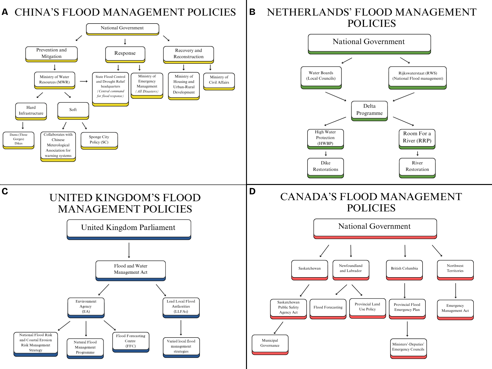

# Climate Change & Flooding
**By Gabriele Budarick, Kyrelle Ann Dumacyon, Isabel Goncalves, Jasmin Pinnock, Sruti Prabakaran (Group 2)**

## Introduction and Methodology
Floods can impact many sectors of society, including the economy, infrastructure and citizen health (Mita et al. 2025).  Climate change is projected to increase the frequency and severity of floods, elevating economic burden and mortality (United Nations Office for Disaster Risk Reduction, 2025). Through a literature review, we compared the structure and effectiveness of flood management policies within China, the Netherlands, the United Kingdom (UK), and Canada, all of which face notable flood risks. 

## Overview of Flood Management Policies by Country
### China
China’s flood-prevention system has a dedicated national ministry to each aspect of flood policy, which is enacted by local governments. The Ministry of Water Resources is responsible for building infrastructure to mitigate damages. The Ministry of Emergency Management and the Flood Proofing Headquarters handle immediate flood response, while the Housing and Civil Affairs ministries manage the aftermath (Ding et al. 2022). Increased urbanization and rising sea levels prompted the national government to launch the Sponge City program to improve drainage in high density areas. The program’s effectiveness is dubious due to the lack of long-term research and no universal implementation policy (Li et al. 2017; Zeng et al. 2022).

### The Netherlands
The Netherlands has become a global leader in flood management. The local water boards and the national Rijkswaterstaat (RWS) serve as the country's primary water management authorities (Ministerie van Infrastructuur en Waterstaat 2025). They collaborate on the Delta Programme, the Netherland’s water management policy, implementing projects such as the High Water Protection Programme (HWBP) and Room for a River Programme (RRP; Organisation for Economic Co-operation and Development 2015). The HWBP is the nation’s largest dike reinforcement effort, aiming to upgrade all dikes by 2050 (Rijkswaterstaat 2019). The RRP centers around widening river flood plains along the Netherland’s main river systems (Central Dredging Association 2012). While their policies have been highly successful and influence flood-risk strategies worldwide, local tributaries that are not covered by national programs remain vulnerable (Karin De Bruijn et al. 2023). Nonetheless, the Netherland’s consistent re-evaluation of flood policies demonstrates their commitment to bridging these gaps and improving overall flood management.

### The United Kingdom 
The UK enacted the Flood and Water Management Act to redefine roles for water authorities. The federally-funded Environment Agency (EA) was required to create a national flood management strategy, while Lead Local Flood Authorities (LLFAs) made regional strategies (UK Parliament 2025). The EA formed the National Flood Risk and Coastal Erosion Risk Management Strategy, significantly reducing home flooding. Green infrastructure also mitigates flood risk, though local constraints have hindered implementation. The EA also co-leads highly accurate flood warning systems, effectively managing national flood risk. 

### Canada
Unlike its contemporaries, Canada splits flood policy provincially, tailoring management to specific regions. Policies from Saskatchewan, Newfoundland and Labrador, British Columbia, and the Northwest Territories demonstrate varied approaches to flood response (Government of Saskatchewan 2024; Government of Newfoundland and Labrador 2005; Aitken 2019; Government of Northwest Territories 2018). Municipal authorities, early warning systems, and federal assistance all showcase the adaptability of Canada’s policies on a broader scale (Figure 1).

_Figure 1: A summary of the four policy structures for China (A), the Netherlands (B), the United Kingdom (C), and Canada (D). Generally, the Chinese, Dutch, and British have their flood policies managed at the national level while Canada delegates flood management to their provinces and territories. All countries have some level of flood mitigation and prevention, with warning systems and the use of infrastructure being a common theme._

## Analysis and Conclusions

Federal involvement in flood management varied across these countries. A central authority was found to be beneficial for flood risk management, though some regions effectively mitigated flooding through local councils as well. The use of hard and soft engineering approaches differed between countries, with mixed impacts on project efficacy. Common barriers to flood management included local interest, financial considerations and communication difficulties across levels of government.

## References

Aitken, Katie. 2019. “Provincial Flood Emergency Plan.” Ministry of Forests, Lands, Natural Resource Operations and Rural Development, May 31. https://www2.gov.bc.ca/assets/gov/public-safety-and-emergency-services/emergency-preparedness-response-recovery/provincial-emergency-planning/provincial-flood-emergency-plan.pdf. 

Central Dredging Association. 2012. “Dutch Water Program Room for the River.” https://dredging.org/media/ceda/org/documents/events/ceda/room%20for%20the%20river.pdf. 

Ding, Wei, Jidong Wu, Rumei Tang, Xiaojuan Chen, and Yingjun Xu. 2022. “A Review of Flood Risk in China during 1950–2019: Urbanization, Socioeconomic Impact Trends and Flood Risk Management.” Water 14 (20). https://doi.org/10.3390/w14203246.

Government of Newfoundland and Labrador. 2005. “Newfoundland and Labrador Provincial Land Use Policy Flood Risk Areas.” https://www.gov.nl.ca/mca/files/for-flood-policy-landusepolicyflood.pdf. 

Government of Northwest Territories. 2018. “NWT EMERGENCY PLAN.” https://lanwt.i8.dgicloud.com/_flysystem/repo-bin/2023-05/nwt_emergency_plan.pdf. 

Government of Saskatchewan. 2024. “The Emergency Planning Act | Statutes of Saskatchewan.” https://publications.saskatchewan.ca/#/products/504. 

​​Karin De Bruijn, Bart van den Hurk, Kymo Slager, Guus Rongen, Mark Hegnauer, and Klaas-Jan Van Heeringen. 2023. “Storylines of the Impacts in the Netherlands of Alternative Realizations of the Western Europe July 2021 Floods.” Journal of Coastal and Riverine Flood Risk, ahead of print. https://doi.org/10.59490/jcrfr.2023.0008. 

Li, Hui, Liuqian Ding, Minglei Ren, Changzhi Li, and Hong Wang. 2017. “Sponge City Construction in China: A Survey of the Challenges and Opportunities.” Water 9 (9). https://doi.org/10.3390/w9090594.

​​Ministerie van Infrastructuur en Waterstaat. 2025. “Our History.” Webpagina. https://www.rijkswaterstaat.nl/en/about-us/our-organisation/our-history. 

Mita, Kazi Samsunnahar, Philip Orton, Franco Montalto, and Tsega Anbessie. 2025. “Accumulating Climate Change Influences on Extreme Coastal, Fluvial, and Compound Flooding in the Upper Transition Zone.” Journal of Hydrology 663 (December): 134247. https://doi.org/10.1016/j.jhydrol.2025.134247.

Organisation for Economic Co-operation and Development. 2015. “The Dutch Delta Programme.” Observatory of Public Sector Innovation. https://oecd-opsi.org/wp-content/uploads/2019/07/The-Dutch-Delta-Programme_Netherlands_2010.pdf.

Rijkswaterstaat. 2019. “HWBP - Hoogwaterbeschermingsprogramma.” Webpagina. Rijkswaterstaat en de waterschappen, November 22. https://www.hwbp.nl/over-hwbp.

UK Parliment. 2025. “Future Flood and Water Management Legislation - Committees - UK Parliament.” November 15. https://committees.parliament.uk/work/2462/future-flood-and-water-management-legislation/. 

United Nations Office for Disaster Risk Reduction. 2025. “Water Risks and Resilience.” https://www.undrr.org/implementing-sendai-framework/sendai-framework-action/water-risks-and-resilience.

Zeng, Chen, Emmanuel Mensah Aboagye, Huijun Li, and Shirui Che. 2022. “Comments and Recommendations on Sponge City — China’s Solutions to Prevent Flooding Risks.” Heliyon 9 (1): e12745. https://doi.org/10.1016/j.heliyon.2022.e12745.
