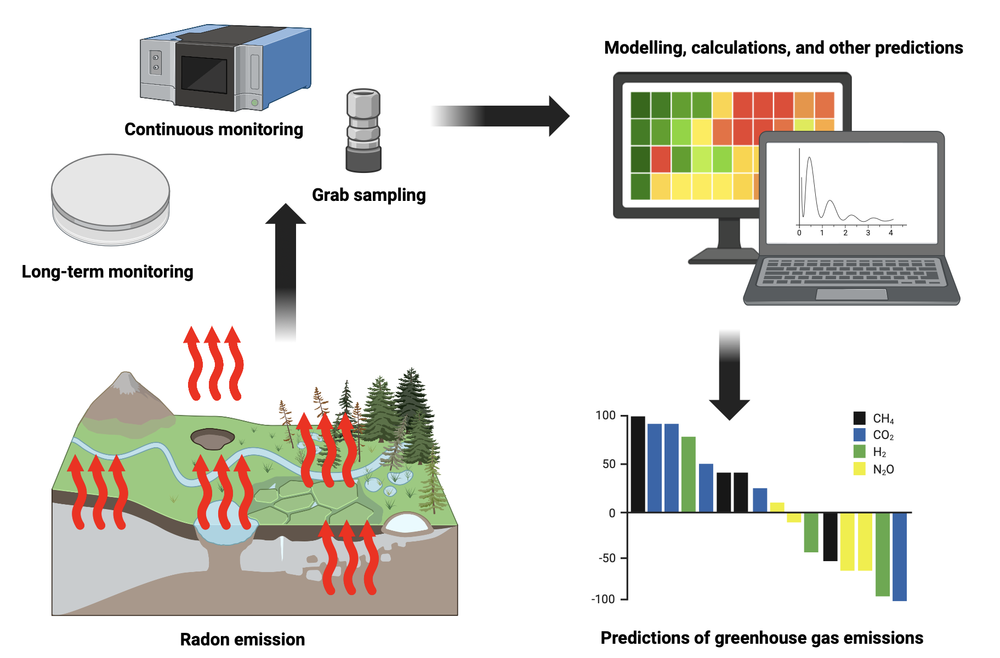

# Radon-222: A Natural Atmospheric Tracer
A major contributor to climate change is the rapidly-increasing rate of greenhouse gas (GHG) emissions. Thus, it is of interest to be able to accurately and continuously track the flux and absolute emissions of GHGs. One promising method involves the use of naturally-occurring atmospheric tracers, such as radon gas. Radon is a chemically inert, radioactive noble gas, produced continuously in rocks and soils from radioactive decay. It is an ideal tracer due to its optimal half-life, which aligns with atmospheric timescales and results in a predictable decay pattern (Baskaran 2016). Consequently, it is widely employed for modeling atmospheric processes, formally known as the Radon Tracer Method (RTM).

## The Radon Tracer Method
The RTM uses the most stable isotope of radon, radon-222 (222Rn), as a tracer to quantify various geological, hydrological, and atmospheric processes (Röttger et al. 2021). Applications of the RTM can be performed using several different measurement techniques to detect 222Rn including: grab sampling, continuous monitoring, and long-term monitoring (Figure 1; Sukanya et al. 2022). Grab sampling provides an instantaneous 222Rn measurement for single-point calibration, while continuous monitoring produces a time-series of 222Rn concentrations to understand diurnal cycles. Long-term integrated monitoring measures cumulative 222Rn concentrations over weeks or months to determine long-term averages.

*Figure 1. Summary of the use of the radon tracer method in atmospheric modelling and other determination methods to predict greenhouse gas emissions. Created using BioRender.*

## The RTM for GHG Emission Tracking
Within atmospheric studies, the main application of the RTM lies within the improvement of atmospheric transport models (ATMs). ATMs are computational models which simulate the movement and dispersal of gases throughout the atmosphere (Gupta et al. 2004). They can be used to predict the distribution of gas(es), or run “backwards” to predict information about the source of the emissions. These models are key in understanding the distribution of GHG to inform climate predictions and fossil-fuel impacts. The RTM can be used to create a baseline emission pattern of 222Rn to evaluate the accuracy of the model and design its developmental parameters (Gupta et al. 2004). 

## Limitations of the RTM
While the RTM is viable, it is important to note its limitations. The temporal and spatial variability of radon flux are major challenges in the prediction of 222Rn, resulting from seasonal and diurnal changes, as well as variation in soil texture and radium content (Rábago et al. 2022). Climate change further presents a limitation, as prolonged droughts and heavy rainfall can considerably alter radon flux, introducing systematic biases in environmental studies (Levin et al. 2021). Variability caused by climate change can lead to inaccuracies in calculated GHG emissions, making the RTM less reliable (Rathebe et al. 2025). Stable, unreactive halogenated gases offer a possible customizable alternative, but also present GHG potential and various other environmental concerns.

In summary, the RTM has been demonstrated as an effective method for environmental studies and can be conducted using various techniques. In particular, it is useful in tracking GHG emissions, as well as improving models to predict GHG behaviour. Although there are limitations to the reliability of the method, it remains a useful tool for atmosphere and climate scientists alike. 

## References
Baskaran, Mark. 2016. ‘Radon Measurement Techniques’. In *Radon: A Tracer for Geological, Geophysical and Geochemical Studies*, edited by Mark Baskaran. Springer International Publishing. https://doi.org/10.1007/978-3-319-21329-3_2. 

Levin, Ingeborg, Ute Karstens, Samuel Hammer, Julian DellaColetta, Fabian Maier, and Maksym Gachkivskyi. 2021. ‘Limitations of the Radon Tracer Method (RTM) to Estimate Regional Greenhouse Gas (GHG) Emissions – a Case Study for Methane in Heidelberg’. *Atmospheric Chemistry and Physics* 21 (23): 17907–26. https://doi.org/10.5194/acp-21-17907-2021. 

Li, Huiying, Ruomei Xie, Zhongkai Fan, et al. 2025. ‘Verification of the Applicability of the RAD7 Radon Monitor to the Solid Radon Source Exhalation Reference Model’. *Nuclear Engineering and Technology* 57 (5): 103341. https://doi.org/10.1016/j.net.2024.11.043. 

Misdaq, M. A., A. Talbi, and J. Ouguidi. 2019. ‘Measurement of Radon, Thoron and Their Daughters in the Air of Marble Factories and Resulting Alpha-Radiation Doses to the Lung of Workers’. *Environmental Geochemistry and Health* 41 (5): 2209–22. https://doi.org/10.1007/s10653-019-00276-9. 

Quindos-Poncela, L. S., P. L. Fernandez, C. Sainz, J. Arteche, J. G. Arozamena, and A. C. George. 2003. ‘An Improved Scintillation Cell for Radon Measurements’. *Nuclear Instruments and Methods in Physics Research Section A: Accelerators, Spectrometers, Detectors and Associated Equipment* 512 (3): 606–9. https://doi.org/10.1016/S0168-9002(03)02049-7. 

Rábago, Daniel, Luis Quindós, Arturo Vargas, et al. 2022. ‘Intercomparison of Radon Flux Monitors at Low and at High Radium Content Areas under Field Conditions’. *International Journal of Environmental Research and Public Health* 19 (7): 4213. https://doi.org/10.3390/ijerph19074213. 

Rathebe, Phoka C., Khathutshelo Vincent Mphaga, and Daniel M. Masekameni. 2025. ‘Climate Change and Environmental Radioactivity: A Review of Studies on Climate Conditions in Variation on Indoor Radon Concentrations’. *Environmental Monitoring and Assessment* 197 (4): 446. https://doi.org/10.1007/s10661-025-13889-8. 

Röttger, Annette, Stefan Röttger, Claudia Grossi, et al. 2021. ‘New Metrology for Radon at the Environmental Level’. *Measurement Science and Technology* 32 (12): 124008. https://doi.org/10.1088/1361-6501/ac298d.

Soldati, Gaia, Gianfranco Galli, Antonio Piersanti, and Valentina Cannelli. 2022. ‘Multi-Level Continuous Monitoring of Indoor Radon Activity’. *Journal of Environmental Radioactivity* 250 (September): 106919. https://doi.org/10.1016/j.jenvrad.2022.106919. 

Sukanya, S., Jacob Noble, and Sabu Joseph. 2022. ‘Application of Radon (222Rn) as an Environmental Tracer in Hydrogeological and Geological Investigations: An Overview’. *Chemosphere* 303 (September): 135141. https://doi.org/10.1016/j.chemosphere.2022.135141.
