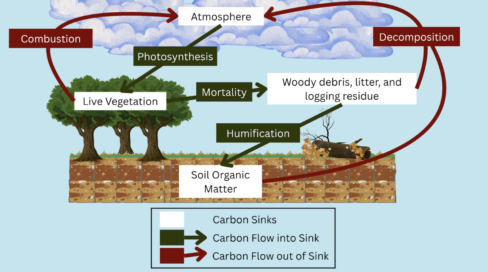
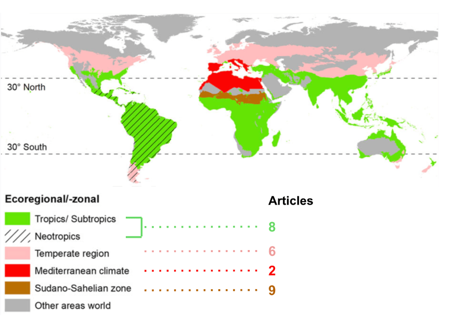

# Agroforestry as a Proposed Solution Within the Tropics
**By Durezernab Berki, Lola Chan, Fiona Duyu, Oviya Sathiyanarayanan, Sarah Winter**

## Introduction
Climate change is becoming one of the most urgent global challenges of our time. Rising carbon dioxide (CO2) levels drive warmer temperatures, threatening wildlife and biodiversity (Sokal and Kachel 2025). Despite global variability, the tropics are highly vulnerable due to their sensitivity to extreme weather. This urgently raises the need for a practical solution that can reduce the effects of climate change and prevent further repercussions. A promising approach is agroforestry, a land-use system that integrates agriculture and forestry. It can provide a variety of benefits, a notable one being carbon sequestration, which is the process of capturing and storing CO2 from the atmosphere (Figure 1).

*Figure 1: This diagram shows carbon moving through the environment and its storage. White boxes show the main carbon “storage spots,” or carbon sinks. Green boxes and arrows show where carbon is absorbed, and red arrows show where carbon is being released back into the air. Photosynthesis is the process where trees take in carbon from the atmosphere. In this case, the focus is on the carbon stored in woody vegetation, which is important in agroforestry systems. Mortality refers to litterfall or death of vegetation, with carbon remaining stored in dead plant material. Humification is the process that turns this dead material into soil organic matter, allowing the carbon to move from vegetation into the soil. Combustion refers to burning, which sends stored carbon back into the atmosphere. Decomposition occurs as microbes break down dead trees or soil organic carbon. This also releases carbon back into the air. The sinks and carbon flows shown here do not cover every carbon pathway found in forests, but only those relevant to this analysis.(Sedjo and Sohngen 2012).* 

## Analysis and Discussion
The implementation of agroforestry within the tropics is long-standing, effectively using community-based management to meet local needs. Upon constructing a merit analysis, agroforestry satisfies almost all required factors for implementation to be a success. Comprising a large portion of the world’s agricultural land, agroforestry is well employed in the tropics, although its execution remains varied by region. In addition to agroforestry’s ability to sequester large amounts of atmospheric carbon, it provides other agricultural benefits, including improved soil quality and erosion control (Abebaw et al. 2025). Through governmentally supported monetary incentives in the form of payments for ecosystem services, farmers are able to afford agroforestry methods (Le et al. 2024). Socially, agroforestry combines traditional Indigenous practices, encouraging neighbouring farmers to become open minded to a variety of cultural beliefs and build community reliance (Ngapo et al. 2021). 

## Limitations
Despite agroforestry's advantages, certain limitations combat success, all of which should be considered when evaluating outcomes. The lack of random trials in agroforestry research poses a gap, with many financial numbers being derived from hypothetical models. Short evaluation periods also neglect to provide enough time to see long-term results (Miller et al., 2019). Lastly, uneven geographic representation limits agroforestry research, with majority of the tropics being represented by only a few regions and agroforestry practices (Figure 2) (Le et al. 2024).

*Figure 2. The map of the world divided into zones based on how review articles directed their focus regionally. The tropical and subtropical regions fall within the 30° North and the 30° South markers. The topics, subtropics, and neotropics had 8 articles focused on them, however very spread across the regions. The Mediterranean climate in comparison had only 2 articles, and thus a lower amount. The Sudan-Sahelian zone had 9 articles concentrated in a relatively smaller region, and thus the greatest focus comparatively. This highlights a disproportionate amount of agroforestry research within the tropics, with some areas being excessively studied while some regions had no research on them at all (Köthke et al. 2022).*

## Recommendations
Agroforestry offers a sustainable climate-alternative solution to establish right now and in the future (Abebaw et al. 2025). Its infrastructure can sequester carbon and reduce community vulnerability to warming impacts, especially for tropic communities whose livelihoods depend on agriculture. Implementation benefits from economic funding and cultural awareness.

## Conclusion
Awareness of these limitations are critical to increase the quality of agroforestry studies and apply suitable future directions. These directions include bridging geographical, scientific, and sociological knowledge gaps through stronger policies, evaluating the means of how agroforestry can be adopted long-term (Waqas et al. 2025). Implementation in less researched regions can help better understand practices. Farmer livelihood would benefit from assessments of wellbeing that directly mixes with the output of agroforestry. Financially, the next steps for agroforestry can include economic cost data, focusing on making financial programs and incentives equitable to all of the tropic population, many of whom are impoverished (Le et al. 2024). By understanding its theoretical basis, merit analysis, limitations, and future directions, agroforestry in the tropics is shown to be a practical solution that could change future farming practices. 

## References
Abebaw, Sintayehu Eshetu, Esubalew Molla Yeshiwas, and Tadla Guadie Feleke. 2025. “A Systematic Review on the Role of Agroforestry Practices in Climate Change Mitigation and Adaptation.” Climate Resilience and Sustainability 4 (2): e70018. https://doi.org/10.1002/cli2.70018. 

Köthke, Margret, Vianny Ahimbisibwe, and Melvin Lippe. 2022. “The Evidence Base on the Environmental, Economic and Social Outcomes of Agroforestry Is Patchy—An Evidence Review Map.” Frontiers in Environmental Science 10 (August). https://doi.org/10.3389/fenvs.2022.925477. 

Le, Tuyet-Anh T., Kelly Vodden, Jianghua Wu, Ryan Bullock, and Gabriela Sabau. 2024. “Payments for Ecosystem Services Programs: A Global Review of Contributions towards Sustainability.” Heliyon 10 (1): e22361. https://doi.org/10.1016/j.heliyon.2023.e22361. 

Ngapo, Tania M., Pauline Bilodeau, Yves Arcand, et al. 2021. “Historical Indigenous Food Preparation Using Produce of the Three Sisters Intercropping System.” Foods 10 (3): 524. https://doi.org/10.3390/foods10030524. 

Miller, D. C., Ordoñez, P. J., Brown, S. E., Forrest, S., Nava, N. J., Hughes, K., & Baylis, K. (2019). The impacts of agroforestry on agricultural productivity, ecosystem services, and human well‐being in low‐and middle‐income countries: An evidence and gap map. Campbell Systematic Reviews, 16(1). https://doi.org/10.1002/cl2.1066

Sedjo, Roger, and Brent Sohngen. 2012. “Carbon Sequestration in Forests and Soils.” Annual Review of Resource Economics 4: 127–44. https://www.jstor.org/stable/43202727. 

Sokal, Karolina, and Magdalena Kachel. 2025. “Impact of Agriculture on Greenhouse Gas Emissions—A Review.” Energies 18 (9): 2272. https://doi.org/10.3390/en18092272. 

Waqas, Muhammad, Adila Naseem, Usa Wannasingha Humphries, Phyo Thandar Hlaing, Muhammad Shoaib, and Sarfraz Hashim. 2025. “A Comprehensive Review of the Impacts of Climate Change on Agriculture in Thailand.” Farming System 3 (1): 100114. https://doi.org/10.1016/j.farsys.2024.100114. 
