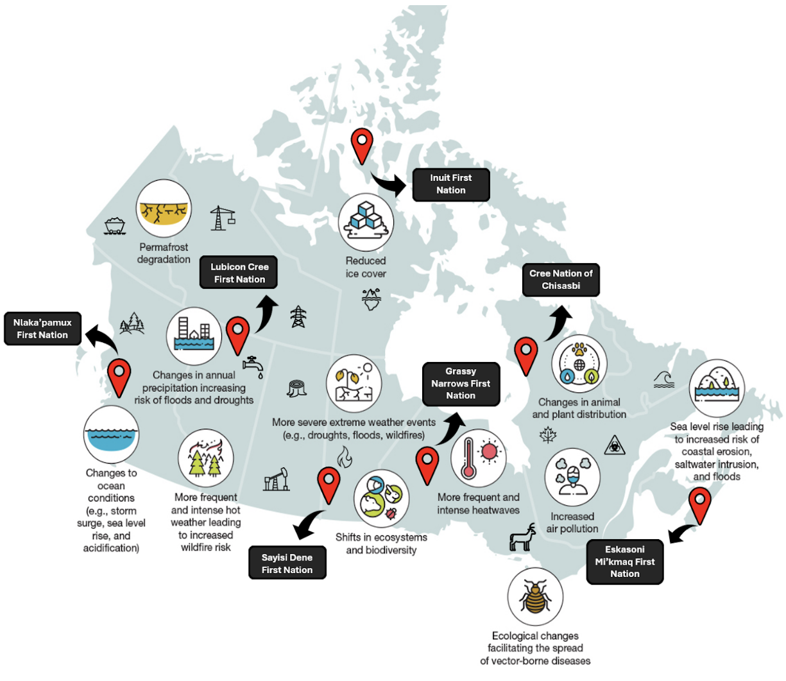
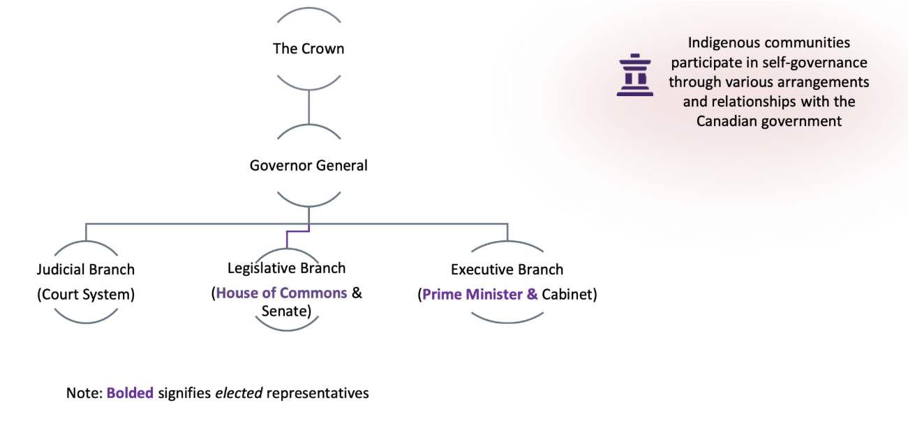

# Reconciling Western and Indigenous Ways of Knowing to Inform Canadian Climate Policy: A Two-Eyed-Seeing Approach
**By Mara Girleanu, Tazeen Hemraj, Adam Owiar, Vamika Sharma, and Asia Vanzante**

## 1. Reframing Climate Change as a Product of Imperialism 

Climate change continues to exacerbate the already debilitating consequences of imperialism, particularly on Indigenous peoples, post-colonial states, and low-income communities (Mercer and Simpson 2023). Imperialist powers have impacted these communities through land theft, forced displacement, and brutalization, resulting in generational socio-economic consequences and ongoing political interference in their affairs. Despite the existence of infrastructure and technology to counteract the consequences of climate change, they remain inaccessible to these demographics. The climate crisis continues to be entangled with colonial extraction, environmental destruction, and inequitable narratives and policies that impact the lives of racialized populations, referred to as “climate coloniality” (Sultana 2022). 

The effects of the climate crisis cannot be fully mitigated without the reframing of climate science, or the ways in which it is understood (Mercer and Simpson 2023). Climate science does not have to rely on Western knowledge through peer-reviewed journal articles; it can be informed by the human experience of those impacted by the climate crisis (Mercer and Simpson 2023). This does not mean that traditional and Indigenous knowledge should be used to supplement Western knowledge, but instead, should be prioritized and valued in the same way.

---

## 2. The Disproportionate Consequences of Climate Change  

Western practices and reluctance to change modern policies have exacerbated the consequences of climate change (Daigle et al. 2015). Colonialism has systematically placed Indigenous peoples into ecologically fragile zones to prioritize colonial access to more desirable lands (Figure 1). These decisions have left Indigenous communities with unsafe housing, polluted food and water systems, and limited infrastructure (Shute et al. 2024). Collectively, these factors create disproportionate vulnerability to floods, wildfires, sea level rise, and other climate disasters for Indigenous communities, perpetuating social and health inequities that colonialism initially imposed and continues to sustain (Government of Canada 2022). 

*Figure 1: Climate change-related environmental issues in Canada, along with the locations of Indigenous groups in various provinces and territories. The Indigenous groups have been situated in environmentally hazardous areas in which climate change is more pronounced. From the Nlaka’pamux in British Columbia to the Inuit of the Arctic, the Cree Nation of Chisasibi in northern Quebec, Grassy Narrows in Ontario, and the Eskasoni Mi’kmaq First Nation in Atlantic Canada, each faces region-specific climate threats. Together, the colonial roots of the placement of Indigenous communities have made them disproportionately vulnerable to accelerating climate change in the modern day. Figure adapted from the Government of Canada 2022.*

---

## 3. The Development of Canadian Climate Policies 

Canadian policies shape how governments identify, evaluate, and respond to social, environmental, and economic challenges across the country (Government of Canada 2017). However, the Canadian government has demonstrated systemic biases that impede meaningful collaboration with Indigenous peoples, often developing policies that undermine their involvement. While legal decisions proclaim to respect Indigenous rights, government officials are not required to follow Indigenous laws or decision-making traditions. That means Indigenous communities can participate in consultations, but their consent or traditional governance systems are not built into the approval framework (Figure 2) (Government of Canada 2025a). 

*Figure 2:  Overview of the Canadian federal government and its relationship to Indigenous self-governance. Canada’s constitutional structure begins with the Crown, represented federally by the Governor General. Beneath this are three branches: the Judicial Branch, the Legislative Branch, made up of the elected House of Commons and appointed Senate, and the Executive Branch, led by the Prime Minister and Cabinet. Indigenous peoples maintain distinct systems of self-governance that interact with, but operate outside of, this federal structure (Government of Canada 2025b).*

---
## 4. Two Eyed seeing as an Integrative Approach to Climate Change

To genuinely involve Indigenous communities, Canada must move beyond token consultation and instead toward co-decision-making and sovereign participation in policy creation. This ensures that climate governance reflects a diversity of epistemologies rather than reinforcing colonial hierarchies (Bartlett et al. 2012). This is what Etuaptmumk or “Two-Eyed Seeing” (E/TES) demonstrates. It is a Mi’kmaw-guided principle about how knowledge itself should be approached, beginning from the recognition that there are at least two distinct ways of knowing the world–Indigenous knowledge and Western knowledge. 

---

## 5. Conclusion 
Ultimately, a just climate policy requires recognizing Indigenous peoples not as stakeholders to be consulted, but as architects of policy and as leaders whose historical, cultural, and ecological expertise must guide national strategies. Only through such shared governance can Canada begin to decolonize its climate policies and address the systemic inequities that perpetuate climate coloniality.

---

## 6. References
Bartlett, Cheryl, Murdena Marshall, and Albert Marshall. 2012. “Two-Eyed Seeing and Other Lessons Learned within a Co-Learning Journey of Bringing Together Indigenous and Mainstream Knowledges and Ways of Knowing.” Journal of Environmental Studies and Sciences 2 (4): 331–40. https://doi.org/10.1007/s13412-012-0086-8. 

Daigle, Réal, Lisa Young, and Pie’l Paul. 2015. Impacts of Climate Change and Sea Level Rise on the Mi’kmaq Communities of the Bras d’Or Lakes. http://dev.uinr.ca/wp-content/uploads/2016/11/AANDC-Climate-Change_UINR-Final-Report-WEB.pdf. 

Government of Canada. 2017. “The Process of Developing a Policy.” August 28. https://www.canada.ca/en/heritage-information-network/services/digital-preservation/concepts-developing-policies/process-developing-policy.html. 

Government of Canada. 2025a. “Consolidated Federal Laws of Canada, Impact Assessment Act.” June 2. https://laws.justice.gc.ca/eng/acts/i-2.75/page-1.html. 

Government of Canada. 2025b. “Decision-Making in the Federal Government: Infographic (FON1-J12).” Education and awareness. 

Government of Canada, September 29. https://www.csps-efpc.gc.ca/tools/jobaids/decision-making-info-eng.aspx. 

Government of Canada, Public Health Agency of. 2022. “Full Report: Mobilizing Public Health Action on Climate Change in Canada: Chief Public Health Officer’s Report on the State of Public Health in Canada 2022.” Research. October 25. https://www.canada.ca/en/public-health/corporate/publications/chief-public-health-officer-reports-state-public-health-canada/state-public-health-canada-2022/report.html. 

Mercer, Harriet, and Thomas Simpson. 2023. “Imperialism, Colonialism, and Climate Change Science.” WIREs Climate Change 14 (6): e851. https://doi.org/10.1002/wcc.851. 

Shute, Jeremy, Alsion Gamble, and Andrew Dieleman. 2024. Indigneous Housing and Climate Resilience Report. January 15. https://climateinstitute.ca/wp-content/uploads/2024/11/CCI_IndigenousHousingAndClimateResilience.pdf. 

Sultana, Farhana. 2022. “The Unbearable Heaviness of Climate Coloniality.” Political Geography 99 (November): 102638. https://doi.org/10.1016/j.polgeo.2022.102638. 

