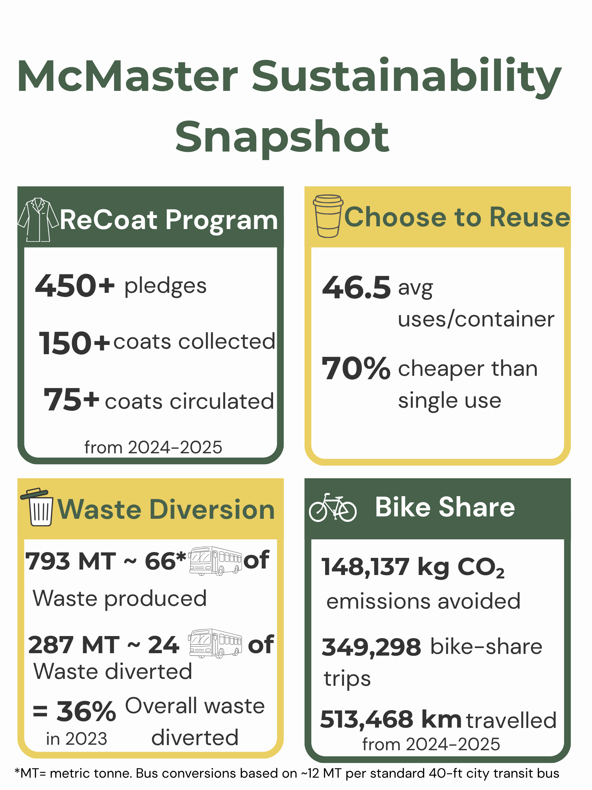

# Assessing the Impact and Limitations of Sustainability Initiatives at McMaster
**By Jasleen Dhillon, Kristen Falik, Siya Sood, Ariya Sud, Jenny Yong**
  
## Introduction

McMaster University is a hub for a wide range of sustainability initiatives aiming to reduce waste, lower emissions, and create a more environmentally responsible campus. This summary highlights key actions in sustainable transportation, food and paper waste reduction, energy and electronic management, and campus-wide initiatives, evaluating how effective they are as a climate action strategy.

## Sustainable Transportation Options

McMaster University’s transportation programs and initiatives show how students can take real steps toward climate action. The Hamilton Street Railway discounted bus pass for students, carpool options, and Hamilton Bike Share U-Pass give affordable, sustainable ways to reach campus. In particular, since the Bike Share U-Pass was introduced in 2024, more than 8,800 students have joined, taking over 349,000 trips and preventing roughly 148,000 kilograms of carbon emissions in just one year (Figure 1) (Waddell 2025). These results show that when accessible, large-scale systems are put in place, students are eager to use sustainable transportation options. 

## Food and Paper Waste 

McMaster’s 2023 waste audit found 325 kg of campus garbage, including 27 kg (8.2%) of food waste, 12.3% paper towel waste, and 30% of mixed paper. This analysis highlighted how students are throwing recyclable and compostable material into the general waste instead of their respective bins. We recommend expanding clearly labelled compost bins to all buildings, improving recycling and compost signage, and using social media and education campaigns to support McMaster in meeting Ontario’s 2025 targets for reducing and recovering food and organic waste. (WRG and McMaster University 2023)

## Electronic Waste and Energy

McMaster has implemented various initiatives to address electronic waste, promote renewable energy, and reduce reliance on fossil fuels. To limit electronic waste, the student-led Trash to Treasure project and tech-bins in Mills were made to divert electronics from landfills through proper recycling or repair/redistribution (Lee et al. 2018). However, these initiatives are discontinued, underscoring the need for renewed and accessible electronic waste programs throughout the school year. In terms of energy, McMaster has developed a net-zero carbon roadmap outlining emission reduction targets for 2030 and 2050 (McMaster University 2022). A key limitation to their implementation on a wider scale is financial constraints, making external funding imperative for success. 

## Campus Initiatives and Research

McMaster has created a Sustainability Strategy to address sustainability challenges and mitigate environmental consequences (McMaster University, n.d.). McMaster supports campus-wide, everyday sustainability through initiatives that encourage reuse, waste reduction, and student engagement. Some initiatives include providing seed gardens and repair services in libraries, alongside building pollinator gardens around campus (McMaster Facility Services, n.d.-a.; Doro 2025). Additionally, the ReCoat program extends the life of lab coats by collecting and redistributing used coats to students, and the Choose to Reuse Program replaces disposable takeout containers with reusable ones across dining locations (Figure 1) (ReCoat McMaster, n.d.; McMaster Hospitality Services, n.d.). Sustainable research is also being conducted on campus, where researchers are working to address environmental threats driven by climate change.

## Conclusion

McMaster has made great strides in addressing sustainability challenges, as evidenced by metrics such as increased sustainable transportation, reductions in greenhouse gas emissions, and the implementation of renewable energy (Figure 1). However, future steps should include raising awareness of sustainable campus initiatives, ensuring that promoted services are actually implemented, and guaranteeing the long-term success of current practices. 

  

*Figure 1: McMaster sustainability snapshot capturing the impacts from initiatives at McMaster, including ReCoat, choose to reuse pass, low carbon transportation through the SoBi bike share program, and campus waste diversion performance. Bus-equivalent estimates are calculated using an average transit-bus weight of approximately 12 metric tonnes, based on North American 40-ft city bus specifications. MT refers to metric tonnes (1 tonne = 1000 kg) (George 2015; ReCoat McMaster, n.d.; McMaster Hospitality Services, n.d.; Waddell 2025; WRG and McMaster University 2023). Figure created by author in Canva.*

## References 

Doro, Nicole. 2025. “McMaster LibGuides: A Guide to Sustainability: Home.” McMaster Libraries, November 10. https://libguides.mcmaster.ca/sustainability/home.

George, Tyler Ross. 2015. An Analysis of Transit Bus Axle Weight Issues. https://trid.trb.org/view/1344157

Lee, David, Ezza Jalil, Alex Johnston, Francis Lao, Yina Shan, and Ajarat Bolade. 2018. “Policy Paper: Environmental Sustainability.” McMaster Students Union. https://msumcmaster.ca/app/uploads/2024/08/Environmental-Sustainability-Policy-Paper-revised-23F.pdf.

McMaster Facility Services. n.d. “Native Bees at McMaster.” Facility Services. Accessed November 14, 2025. https://facilities.mcmaster.ca/sustainability/native-bees-at-mcmaster/.

McMaster Hospitality Services. n.d. “Choose to Reuse.” Hospitality Services. Accessed November 14, 2025. https://hospitality.mcmaster.ca/wellness-sustainability/sustainability/choose-to-reuse/.

McMaster University. 2022. “McMaster’s Campus Is on the Road to Net Zero Carbon Emissions.” McMaster News, April 21. https://news.mcmaster.ca/mcmasters-campus-is-on-the-road-to-net-zero-carbon-emissions/.

McMaster University. n.d. “McMaster’s Sustainability Strategy.” Online Publications. Accessed November 14, 2025. https://publications.mcmaster.ca/catalogue/mcmaster-university/sustainability-strategy-2022-26/.

ReCoat McMaster. n.d. “Home.” ReCoat on Campus. Accessed November 14, 2025. https://www.recoatoncampus.com.

Waddell, Ryan. 2025. 2024-2025 Hamilton Bike Share - McMaster U-Pass Annual Report to MSU. July 29. https://msumcmaster.ca/app/uploads/2025/08/2024-25-HBSI-McMaster-U-Pass-Annual-Report-to-MSU.pdf

WRG and McMaster University. 2023. 2023 Waste Audit. McMaster University. https://facilities.mcmaster.ca/app/uploads/2024/10/P1423-McMaster-University-2023-Waste-Audit-Report.pdf.

