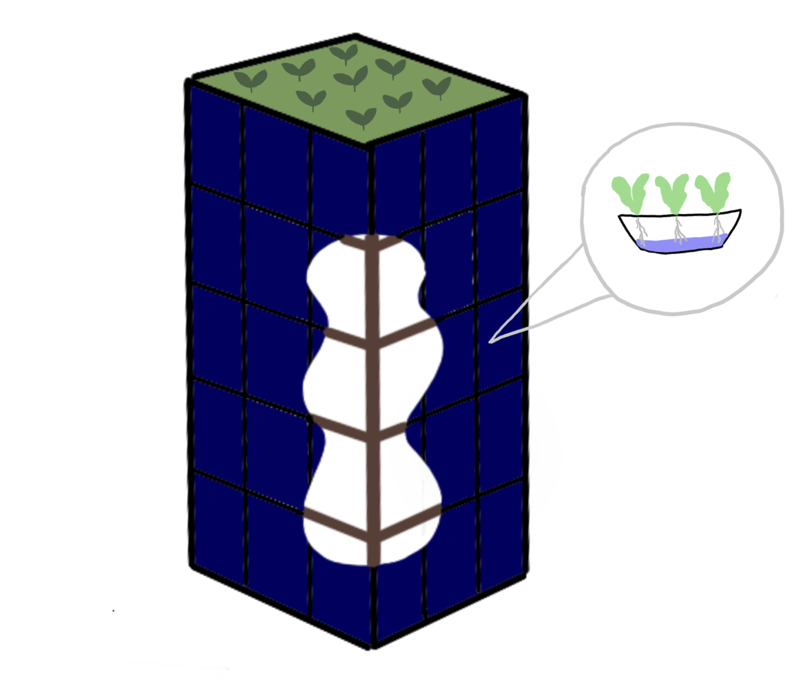
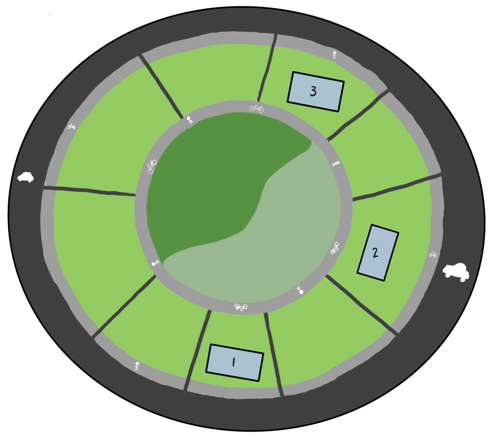

<h1>Sustainable Communities to Mitigate Climate Change</h1>

<h2>Public Summary</h2>

Clara Austrins, Matthew Fanciulli, Amanda Round, Lily Seebach, and Camille Tsang

iSci 3A12, Fall 2022

  

##### Context
To aid in the mitigation of climate change, we propose the implementation of a small-scale sustainable community in an unspecified region of Southern Ontario. This community is not meant to solve global climate issues, rather we are attempting to increase the ability of our communities to adapt to and mitigate climate change.
##### Justification
In our community, there are five key aspects of sustainable development to consider: buildings,  energy generation, urban agriculture, transportation, and urban green spaces. With proper design, these factors will allow the community to flourish long-term. Firstly, designing and constructing buildings to reduce their lifetime emissions is an important part of mitigating a main driver of climate change (Pomponi and Moncaster, 2016; Abed et al., 2022; Grinham et al., 2022). Transitioning to community-based renewable energy sources to power these buildings can drastically decrease greenhouse gas (GHG) emissions associated with urban energy generation (Falk, Durschner and Remmers, 2013; Temiz and Dincer, 2022). Additionally, centralising food production within communities can safeguard them against the negative effects of climate change which affect the supply chain and agricultural infrastructure (United Nations, 2021). Transportation is also one of the main GHG emitters in urban centres and by making communities walkable we can lower overall emissions (Dean et al., 2020; Environment and Climate Change Canada, 2022). Finally, implementing urban green spaces and green infrastructure can help alleviate environmental concerns while improving the lives of citizens (Atiqul Haq, 2011). 
##### Proposal
The community will have three mid-rise mixed-use buildings that house approximately 500 residents with local shops and office spaces. They will be made of timber sourced from Southern Ontario manufacturers and minimal recycled concrete and steel. Traditional HVAC will be removed in favour of innovative climate control strategies and ground-source heat pumps. This will reduce the carbon emissions associated with the lifecycle of our buildings. Our community’s grid will use renewable solar energy by integrating solar panels in building facades, maximising surface area for energy production (Figure 1). We are ensuring that the community will be self-sustaining through the use of on-site anthroponics, a system that combines wastewater treatment with traditional hydroponics. This will cut environmental and financial costs associated with the agri-food sector, while providing food and clean water to the community (Figure 1). Each building will also have a green roof that can serve as a multi-purpose community green space (Figure 1). At the centre of the community, there will be a park that is regularly-maintained as well as a forested area (Figure 2). We plan to place this community near a pre-existing urban region so residents can access other amenities like schools, hospitals, and restaurants with public transit as opposed to personal vehicles. Thus, designing the immediate area to be accessible by walking, biking, or busing allows for more sustainable transportation (Eldeeb, Mohamed and Páez, 2021). 

  

_Figure 1: An artistic rendition of one of the three buildings built from locally sourced timber and sided with solar panels. A living green roof is shown as a communal area for residents to connect to nature. Inside the building, anthroponics are used to serve the community and provide on-site food security (Tsang, 2022b)._

_Figure 2: An artistic rendition of a bird’s eye view of the proposed community, not drawn to scale. At the centre of the community, there is a 0.03 kilometres squared park with a playground, open field space, and forested nature trails. This park has a regularly maintained portion (light green) and a natural portion (dark green). The buildings are located on the regularly maintained side of the park. Within these buildings, there will be office spaces, local shops, and housing units. Surrounding the park, there will be a separated and labelled bike and walking path (light grey). A similar path will also surround the buildings. These two paths will form two concentric circles. Between the bike path and the walking path, there will be trees, benches, bike racks, waste disposal, and water fountains. Enclosing the outer paths will be a motorised vehicle road (black), which will connect the community to the rest of the municipality. The multi-use roads also in black, radiate out from the centre paths like the spokes of a wheel, and function primarily as access roads for public transit or emergency vehicles. There will be painted bike lanes and separate sidewalks on either side of these multi-use roads (Tsang, 2022a)._

  
##### Limitations and Future Implications
While this proposal makes sense socially, limitations such as funding, government policies, and unknown community demographics are barriers to address. With the implementation of multiple small environmentally-friendly communities around Southern Ontario, the province can move towards greener infrastructure for a more sustainable future.
##### Works Cited
Abed, J., Rayburg, S., Rodwell, J. and Neave, M., 2022. A Review of the Performance and Benefits of Mass Timber as an Alternative to Concrete and Steel for Improving the Sustainability of Structures. _Sustainability_, 14(9), 5570. https://doi.org/10.3390/su14095570.  
Atiqul Haq, S.M., 2011. Urban Green Spaces and an Integrative Approach to Sustainable Environment. _Journal of Environmental Protection_, 2, pp.601–608. https://doi.org/10.4236/jep.2011.25069.  
Dean, J., Biglieri, S., Drescher, M., Garnett, A., Glover, T. and Casello, J., 2020. Thinking relationally about built environments and walkability: A study of adult walking behavior in Waterloo, Ontario. _Health & Place_, 64, 102352. https://doi.org/10.1016/j.healthplace.2020.102352.   
Eldeeb, G., Mohamed, M. and Páez, A., 2021. Built for active travel? Investigating the contextual effects of the built environment on transportation mode choice. _Journal of Transport Geography_, 96, 103158. https://doi.org/10.1016/j.jtrangeo.2021.103158.   
Environment and Climate Change Canada, 2022. _Greenhouse gas emissions_. [online] Available at: https://www.canada.ca/en/environment-climate-change/services/environmental-indicators/greenhouse-gas-emissions.html [Accessed 6 November 2022].   
Falk, A., Durschner, C. and Remmers, K.-H., 2013. _Photovoltaics for Professionals: Solar Electric Systems Marketing, Design and Installation_. London: Routledge. https://doi.org/10.4324/9781315065939.   
Grinham, J., Fjeldheim, H., Yan, B., Helge, T.D., Edwards, K., Hegli, T. and Malkawi, A., 2022. Zero-carbon balance: The case of HouseZero. _Building and Environment_, 207, 108511. https://doi.org/10.1016/j.buildenv.2021.108511.  
Pomponi, F. and Moncaster, A., 2016. Embodied carbon mitigation and reduction in the built environment – What does the evidence say? _Journal of Environmental Management_, 181, pp.687–700. https://doi.org/10.1016/j.jenvman.2016.08.036.  
Temiz, M. and Dincer, I., 2022. Development of solar and wind based hydrogen energy systems for sustainable communities. _Energy Conversion and Management_, 269, 116090. https://doi.org/10.1016/j.enconman.2022.116090.   
Tsang, C., 2022a. _A Bird’s Eye-View of a Proposed Sustainable Community_. [Digital Drawing].   
Tsang, C., 2022b. _A Mixed-Use Building in a Proposed Sustainable Community_. [Digital Drawing].   
United Nations, 2021. _New FAO analysis reveals carbon footprint of agri-food supply chain_. [online] UN News. Available at: https://news.un.org/en/story/2021/11/1105172 [Accessed 2 November 2022].

