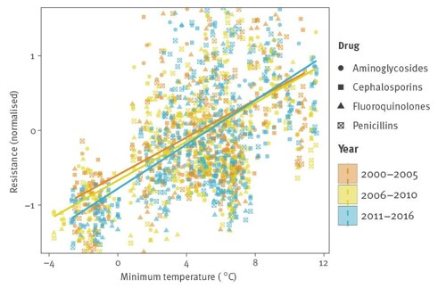

<h1>Executive Public Summary: Effects of Climate Change on the Evolution of Antimicrobial Resistance</h1>

<h2>Public Summary</h2>

Aunika Venables, Bianca Mammarella, Kayla Bulyovsky, Maia Davey, and Yash Joshi 

iSci 3A12, Fall 2022

 

## Introduction
Climate change refers to long-term alterations in temperature and weather conditions, caused naturally or by human activity (IPCC, 2021). This issue has affected every populated region of the planet; however, humans are not the only species impacted (IPCC, 2021). The evolution of antimicrobial resistance (AMR) within organisms is also being influenced by climate change (Cavicchioli et al., 2019). The main drivers of evolution are genetic alterations and horizontal gene transfer (HGT) whereby microbes transfer genetic material from one cell to the other (Ziebuhr et al., 1999). 

## Importance
AMR evolution is important due to its large impact on human health; it is estimated that drug resistance will cause 10 million deaths annually by 2050 and increase costs for healthcare (Finlay et al., 2019). Thus, it is essential to understand how AMR is evolving as a result of climate change such as through increases in temperature, pollution, and biofilm formation.  

## Temperature
Temperature is an essential factor in the growth of microbes, which makes it important to consider when looking at how climate change affects evolution of AMR. As previously mentioned, HGT is one of the major sources of AMR. Further, HGT is linked with temperature because the success of gene transfer increases with this factor (Burnham, 2021). Evolution of AMR can also be amplified through the increase in spontaneous mutations as a result of shock from high temperature environments (Foster, 2007; Rodríguez-Verdugo et al., 2020). Therefore, increasing global temperature as a result of climate change increases the evolution of AMR within microbes (Figure 1) (McGough et al., 2020). 

*Figure 1: Normalized AMR compared to yearly average minimum temperature (°C) for four antimicrobial classes in 28 countries for three five-year periods. The increasing linear trend demonstrates the increasing AMR as the annual minimum temperature rises due to climate change. Adapted from McGough et al., 2020.*

## Pollution
Soil serves as a natural reservoir for antimicrobial resistant genes (ARGs) since it is commonly contaminated with pollutants known to induce expression of ARGs (Pérez-Valdespino et al., 2021). Climate change increases the prevalence of pollutants in soil and as the globe warms, there is an increase in precipitation leading to pollutants entering the soil via factors such as agricultural runoff (Burnham, 2021). Pollutants include heavy metals or nitrogen from fertilizers which enter the environment through flooding. This process becomes more severe with the extreme weather events induced by climate change. ARGs from the pollutants in the soil can then affect humans when they enter the food chain through transfer to crops (Wang et al., 2022).  

## Biofilms
Biofilms are communities of microbes that protect each other from harsh environmental conditions (Gebreyohannes et al., 2019). Biofilms often form plaque on teeth, arteries and heart valves (Schulze et al., 2021). Biofilms pose serious threats to healthcare as they promote ARGs and are responsible for various chronic and persistent infections (Xin et al., 2022). The number of biofilms has increased due to climate change because of the increased temperature and pollutants (Majdi et al., 2020). These environmental stressors from climate change act as selective pressures for the formation and growth of biofilms and evolution of AMR. 

## Conclusion
Climate change and its effects on microbes should be taken with a high degree of concern as it is causing many negative effects including increased AMR evolution. AMR in human pathogens has been shown to have several detrimental effects, which imposes a large burden on Canadian and global healthcare systems. Further, AMR evolution in microbes not causing human disease act as a reservoir for resistance in the microbial community (Rodríguez-Verdugo et al., 2020). Consequently, there is the potential for transfer of resistance to disease causing species, which negatively impacts human health. 

## References

Burnham, J.P., 2021. Climate change and antibiotic resistance: a deadly combination. Therapeutic Advances in Infectious Disease, 8, p.2049936121991374. https://doi.org/10.1177/2049936121991374. 

Cavicchioli, R., Ripple, W.J., Timmis, K.N., Azam, F., Bakken, L.R., Baylis, M., Behrenfeld, M.J., Boetius, A., Boyd, P.W., Classen, A.T., Crowther, T.W., Danovaro, R., Foreman, C.M., Huisman, J., Hutchins, D.A., Jansson, J.K., Karl, D.M., Koskella, B., Mark Welch, D.B., Martiny, J.B.H., Moran, M.A., Orphan, V.J., Reay, D.S., Remais, J.V., Rich, V.I., Singh, B.K., Stein, L.Y., Stewart, F.J., Sullivan, M.B., van Oppen, M.J.H., Weaver, S.C., Webb, E.A. and Webster, N.S., 2019. Scientists’ warning to humanity: microorganisms and climate change. Nature Reviews Microbiology, 17(9), pp.569–586. https://doi.org/10.1038/s41579-019-0222-5. 

Finlay, B.B., Conly, J., Coyte, P.C., Dillon, J.-A.R., Douglas, G., Goddard, E., Greco, L., Nicolle, L.E., Patrick, D., Prescott, J.F., Quesnel-Vallee, A., Smith, R., Wright, G.D., Harfer, M., Taylor, J. and Yerushalmi, E., 2019. When Antibiotics Fail: The Expert Panel on the Potential Socio-Economic Impacts of Antimicrobial Resistance in Canada. [Monograph] Available at: <https://cca-reports.ca/reports/the-potential-socio-economic-impacts-of-antimicrobial-resistance-in-canada/> [Accessed 13 November 2022]. 

Foster, P.L., 2007. Stress-Induced Mutagenesis in Bacteria. Critical reviews in biochemistry and molecular biology, 42(5), pp.373–397. https://doi.org/10.1080/10409230701648494. 

Gebreyohannes, G., Nyerere, A., Bii, C. and Sbhatu, D.B., 2019. Challenges of intervention, treatment, and antibiotic resistance of biofilm-forming microorganisms. Heliyon, 5(8), p.e02192. https://doi.org/10.1016/j.heliyon.2019.e02192. 

IPCC, 2021. Summary for Policymakers. Climate Change 2021: The Physical Science Basis. Contribution of Working Group I to the Sixth Assessment Report of the Intergovernmental Panel on Climate Change. Cambridge, United Kingdom: Cambridge University Press. pp.3–32. 

Majdi, N., Uthoff, J., Traunspurger, W., Laffaille, P. and Maire, A., 2020. Effect of water warming on the structure of biofilm-dwelling communities. Ecological Indicators, 117, p.106622. https://doi.org/10.1016/j.ecolind.2020.106622. 

McGough, S.F., MacFadden, D.R., Hattab, M.W., Mølbak, K. and Santillana, M., 2020. Rates of increase of antibiotic resistance and ambient temperature in Europe: a cross-national analysis of 28 countries between 2000 and 2016. Eurosurveillance, 25(45), p.1900414. https://doi.org/10.2807/1560-7917.ES.2020.25.45.1900414. 

Pérez-Valdespino, A., Pircher, R., Pérez-Domínguez, C.Y. and Mendoza-Sanchez, I., 2021. Impact of flooding on urban soils: Changes in antibiotic resistance and bacterial community after Hurricane Harvey. Science of The Total Environment, 766, p.142643. https://doi.org/10.1016/j.scitotenv.2020.142643. 

Rodríguez-Verdugo, A., Lozano-Huntelman, N., Cruz-Loya, M., Savage, V. and Yeh, P., 2020. Compounding Effects of Climate Warming and Antibiotic Resistance. iScience, 23(4), p.101024. https://doi.org/10.1016/j.isci.2020.101024. 

Schulze, A., Mitterer, F., Pombo, J.P. and Schild, S., 2021. Biofilms by bacterial human pathogens: Clinical relevance - development, composition and regulation - therapeutical strategies. Microbial Cell, 8(2), pp.28–56. https://doi.org/10.15698/mic2021.02.741. 

Wang, T., Sun, S., Xu, Y., Waigi, M.G., Odinga, E.S., Vasilyeva, G.K., Gao, Y. and Hu, X., 2022. Nitrogen Regulates the Distribution of Antibiotic Resistance Genes in the Soil–Vegetable System. Frontiers in Microbiology, 13, p.848750. https://doi.org/10.3389/fmicb.2022.848750. 

Xin, K., Chen, X., Zhang, Z., Zhang, Z., Pang, H., Yang, J., Jiang, H. and Lu, J., 2022. Trace antibiotics increase the risk of antibiotic resistance genes transmission by regulating the biofilm extracellular polymeric substances and microbial community in the sewer. Journal of Hazardous Materials, 432, p.128634. https://doi.org/10.1016/j.jhazmat.2022.128634. 

Ziebuhr, W., Ohlsen, K., Karch, H., Korhonen, T. and Hacker, J., 1999. Evolution of bacterial pathogenesis. Cellular and Molecular Life Sciences CMLS, 56(9), pp.719–728. https://doi.org/10.1007/s000180050018. 
