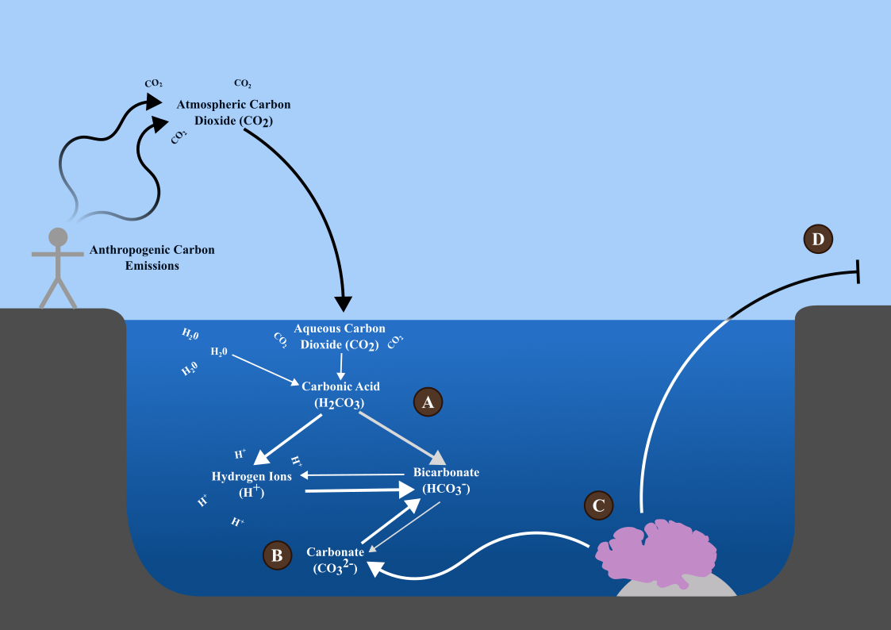

<h1>Not a Basic Problem: Causes and Effects of Anthropogenically-Mediated Ocean Acidification on Marine Ecosystems</h1>

<h2>Public Summary</h2>

Matthew McCarthy, Prutha Patel, Jemimah Ong, and Sylvanna Pavão 

iSci 3A12, Fall 2022

  

## Introduction, Background, & Methodology 
 
The ocean is the largest ecosystem on the planet, spanning over 70% of Earth’s surface, and is responsible for regulating variability in climate (Chakraborty et al., 2022). The ocean sustains many dependent species, including humans who rely on the ocean through fishing, tourism, and economics. Coral reefs play an important role in marine ecosystems, supporting more species per unit area than any other marine environment despite being few in number (Muir et al., 2018). The research focuses on factors influencing ocean acidification (i.e., temperature, anthropogenic activities) and evaluates the effect of this current phenomenon on biodiversity, species health, and the further impacts on humans ourselves. Recognizing the importance and vulnerability of coral reefs stresses the importance of ocean research. 

 

## Figure 1: Ocean Acidification

Figure 1: Anthropogenic carbon emissions release carbon dioxide (CO2) into the atmosphere, making them available for dissolution into the ocean (where it becomes aqueous CO2). (A) With the addition of water, it forms carbonic acid (H2CO3), further turning into hydrogen (H+) and bicarbonate (HCO3-) ions, all of which cause ocean acidification. (B) This acid formation pushes for the conversion of carbonate (CO32-) into bicarbonate ions. (C) Carbonate is an essential component of coral reefs, which are made of calcium carbonate, and this conversion causes demineralisation and overall poor coral health. (D) Negative impacts on the health of coral reefs and other biomineralised organisms can then have further consequences to humans.

 

## Carbonic Acid Formation

 

Hard-shelled animals in the ocean, such as corals, snails, clams, and starfish, use a process known as biomineralisation to create their hard exterior. Biomineralisation is the process of incorporating inorganic minerals, such as calcium carbonate, into the structure of an animal, such as clam shells and coral reefs. When ocean acidification occurs, the amount of carbonate in the environment decreases (Figure 1). Since the shells of many marine organisms are composed of calcium carbonate, this eats away at the existing mineral and limits the ability for these organisms to grow. 
 

## Anthropogenic Activities  

 

In addition, the relationship between climate change and ocean acidification can be heavily attributed to anthropogenic activities. There are direct activities, such as emitting excess amounts of carbon dioxide and overfishing, that increase the risk of ocean acidification (Hoegh-Guldberg et al., 2017). There are also indirect activities, such as declining water quality due to urbanisation in disturbed coastlines and tourism traffic, that affect coral reef populations(Diedrich, 2007; Hoegh-Guldberg, 2011). These direct and indirect influences heavily impact coral reef ecosystems and subsequently, the species that reside within. Not only do human activities threaten coral reef abundance and quality, but it threatens the biodiversity and overall health of the ocean. 

 

## Analysis/Discussion 

 

Rising ocean temperatures due to climate change are a self-perpetuating positive feedback loop; with higher carbon emissions, more carbon is trapped within the atmosphere which further traps heat, causing oceanic temperature to rise (Wiebe and Gaddy, 1940). 
 
Data is limited in this niche area, and that this declining trend may be an oscillation when scaled to a long term metric. With our analyses, we can evidently see that the ocean is a complex and vital ecosystem, performing many roles. It is important to also find ways to prevent the acidification of the ocean even further. Some of these methods include reducing carbon dioxide emissions, reducing coastal pollutants, and adding minerals such as olivine and limestone to ocean waters (Harvey, 2008; Billé et al., 2013; Griffioen, 2017). There are several limitations to these methods, such as expense and additional risks of ecological damage.
 

## Conclusion 

 

While the impact of carbon dioxide emissions on temperature is well-understood, we hope we have helped to educate you about the risks of ocean acidification, and motivated you to take action to help save our coral reefs, our oceans, and our world.

 

## References

 

Allemand, D., Ferrier-Pagés, C. and Furla, P., 2004. Biomineralisation in reef-building corals: from molecular mechanisms to environmental control. [online] https://doi.org/10.1016/j.crpv.2004.07.011.

Billé, R., Kelly, R., Biastoch, A., Harrould-Kolieb, E., Herr, D., Joos, F., Kroeker, K., Laffoley, D., Oschlies, A. and Gattuso, J.-P., 2013. Taking Action Against Ocean Acidification: A Review of Management and Policy Options. Environmental Management, 52(4), pp.761–779. https://doi.org/10.1007/s00267-013-0132-7.

Chakraborty, T., Pattnaik, S., Baisya, H. and Vishwakarma, V., 2022. Investigation of Ocean Sub-Surface Processes in Tropical Cyclone Phailin Using a Coupled Modeling Framework: Sensitivity to Ocean Conditions. Oceans, 3(3), pp.364–388. https://doi.org/10.3390/oceans3030025.

Clark, M., 2020. Molecular mechanisms of biomineralization in marine invertebrates. [online] https://doi.org/doi: 10.1242/jeb.206961.

Diedrich, A., 2007. The impacts of tourism on coral reef conservation awareness and support in coastal communities in Belize. Coral Reefs, 26(4), pp.985–996. https://doi.org/10.1007/s00338-007-0224-z.

Griffioen, J., 2017. Enhanced weathering of olivine in seawater: The efficiency as revealed by thermodynamic scenario analysis. Science of The Total Environment, 575, pp.536–544. https://doi.org/10.1016/j.scitotenv.2016.09.008.

Harvey, L.D.D., 2008. Mitigating the atmospheric CO 2 increase and ocean acidification by adding limestone powder to upwelling regions. Journal of Geophysical Research, 113(C4), p.C04028. https://doi.org/10.1029/2007JC004373.

Hoegh-Guldberg, O., 2011. Coral reef ecosystems and anthropogenic climate change. Regional Environmental Change, 11(1), pp.215–227. https://doi.org/10.1007/s10113-010-0189-2.

Hoegh-Guldberg, O., Poloczanska, E.S., Skirving, W. and Dove, S., 2017. Coral Reef Ecosystems under Climate Change and Ocean Acidification. Frontiers in Marine Science, [online] 4. Available at: <https://www.frontiersin.org/articles/10.3389/fmars.2017.00158> [Accessed 30 October 2022].

Muir, P.R., Wallace, C.C., Pichon, M. and Bongaerts, P., 2018. High species richness and lineage diversity of reef corals in the mesophotic zone. Proceedings of the Royal Society B: Biological Sciences, 285(1893), p.20181987. https://doi.org/10.1098/rspb.2018.1987.

Wiebe, R. and Gaddy, V.L., 1940. The Solubility of Carbon Dioxide in Water at Various Temperatures from 12 to 40° and at Pressures to 500 Atmospheres. Critical Phenomena. [online] https://doi.org/10.1021/ja01861a033.

