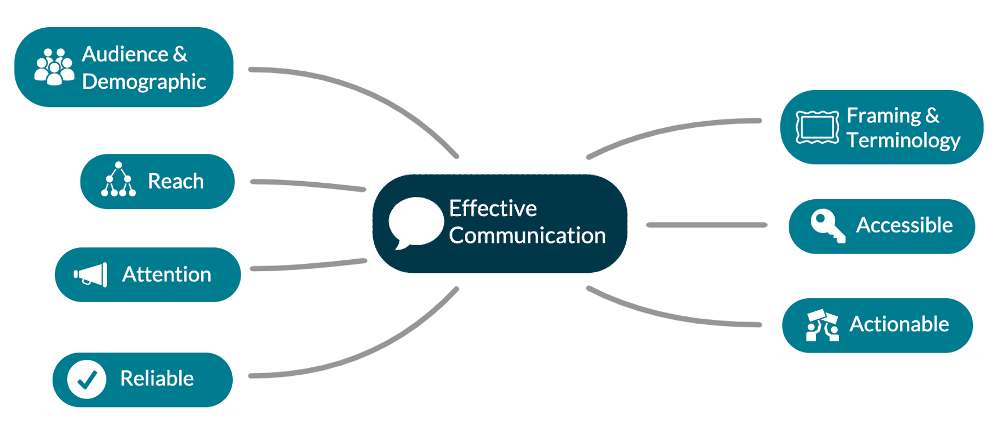

<h1>Climate Change and the Media: A Framework for Effectiveness</h1>

<h2>Public Summary</h2>

Adrian Cam, Sarah Menezes, Muneeza Shoaib, and Ava Whitehead

iSci 3A12, Fall 2022

  

## Introduction
Climate change is an important but complex issue that requires public engagement to promote meaningful action (Howard-Williams, 2009). This engagement occurs through the use of media. Media has two main categories: “social media”, platforms hosted over the internet such as YouTube, TikTok, Instagram, and Twitter, and “traditional media”, platforms used before the internet such as news broadcasts, newspapers, and radio. Studies have shown public engagement increases with social media and decreases with traditional media (Loos and Ivan, 2022). Thus, climate change scientists must consider the use of social media to communicate information about climate issues. This study therefore asks the questions: How should climate scientists use the media to communicate climate change information most effectively to the general public? Should traditional media continue to be used, or has social media become more effective in relaying scientific information about climate change?

## Framework
It is difficult to define how “effective” media communicates information, since the term can be interpreted in several ways. To evaluate “effectiveness”, a framework is designed (Figure 1). This framework consists of seven criteria for which a media platform can be evaluated. When the media meets more of the criteria, it is more effective. 

*Figure 1: A diagram of the framework of media effectiveness developed for use in this study. A literature review was performed in order to identify these seven criteria, as well as their limitations. Only the most popularly discussed of all effectiveness criteria amongst all papers were included in the framework. This framework therefore represents the current state of researcher’s understanding of what makes climate change communication effective through media.*

## Methodology
Through a case study example of a traditional media source (news broadcasting) and a social media source (YouTube), the effectiveness of climate change communications can be studied. Two videos examining the effect of air travel on climate change are compared using reliability, reach, and actionability, three of the least limited effectiveness criteria. The YouTube video originated from the ClimateAdam channel, and the broadcast segment is taken from an episode of CBC News’ The National. These videos were selected due to their similar length, topic, format, and posting date, minimizing bias in the analysis.

## Results/Discussion
By examining our case study examples, it can be concluded that news broadcasts are currently more reliable than YouTube videos. This is due to the high degree of regulation by news corporations compared to the lack of regulation currently on the YouTube platform (Baade, 2019). For reach, The National has approximately 120,000 more views than ClimateAdam’s video (CBC News: The National, 2021; ClimateAdam, 2022; Stocking et al., 2020). However, Youtube may have better reach as it can target specific audiences and connect with groups on a deeper level. Finally, with YouTube creators able to connect to specific audiences, their content becomes more actionable and motivating. The generality of news broadcast content and audience, as well as a high degree of formality, may alienate viewers with broadcast media. This means YouTube videos are more actionable than news broadcasts.

## Conclusion
Accounting for considerations such as increasing social media reliability and specific target audience over pure size, the results of the case study demonstrate that social media meets more of the framework criteria for effectiveness. With the public gravitating towards newer social media platforms over traditional ones (Allgaier, 2019; Loos and Ivan, 2022), climate scientists must adapt to emerging trends in order to communicate their information effectively.

## References
Allgaier, J., 2019. Science and Environmental Communication on YouTube: Strategically Distorted Communications in Online Videos on Climate Change and Climate Engineering. *Frontiers in Communication*, 4. https<spac>://doi.<spac>org/10.3389/<spac>fcomm.2019.00036

Baade, B., 2019. Fake News and International Law. *European Journal of International Law*, 29(4), pp.1357–1376. https<spac>://doi.org/<spac>10.1093/<spac>ejil/chy071.

CBC News: The National, 2021. *The National: Air travel and climate change, land border reopening, EVs*. [video online] Available at: https<spac>://<spac>w<spac>w<spac>w.<spac>youtube<spac>.com/<spac>watch?v=vxc-EYvz6XY

ClimateAdam, 2022. *Flying is worse for the climate than you think*. [video online] Available at: https<spac>://<spac>w<spac>w<spac>w.<spac>youtube.<spac>com/watch?v=Y5ny2TJl3Y8

Howard-Williams, R., 2009. Ideological Construction of Climate Change in Australia and New Zealand Newspapers. In: T. Boyce and J. Lewis, eds. 2009. *Climate Change and the Media*. New York: Peter Lang Publishing Inc. Ch.3.

Loos, E. and Ivan, L., 2022. Not only are people getting old, the new media are too: technology generations and the changes in new media use. *New Media and Society*, 24(12). https<spac>://doi.org/<spac>10.1177/<spac>14614448221101783

Stocking, G., Van Kessel, P., Barthel, M., Masta, K.E. and Khuzam, M., 2020. *Many Americans Get News on YouTube, Where News Organizations and Independent Producers Thrive Side by Side*. [online] Pew Research Center. Available at: <https<spac>://<spac>w<spac>w<spac>w.<spac>pewresearch.<spac>org/journalism/<spac>2020/09/28/many-americans-get-news-on-youtube-where-news-organizations-and-independent-producers-thrive-side-by-side/> [Accessed 16 November 2022].

