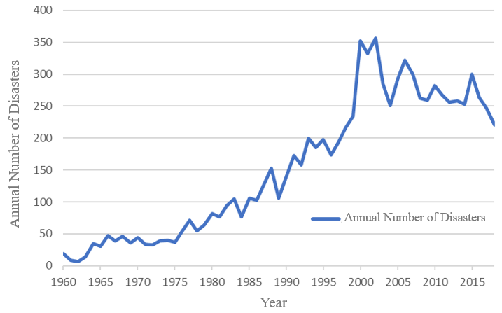

<h1>The Influence of Climate Change on the Frequency and Severity of Natural Disasters</h1>

<h2>Public Summary</h2>

Lily Charles, Micah Eckert, Andrew Stonehouse, Emma Tutt, and Serena Uppal

iSci 3A12, Fall 2022

  

## Impact of Climate Change on Natural Disasters
Natural disasters are becoming increasingly frequent and severe, as a direct result of climate change and global warming (Banholzer, Kossin and Donner, 2014). Many types of disasters are affected, including hurricanes, earthquakes, droughts, floods, and wildfires. These disasters continually cause a significant amount of damage to infrastructure and human populations.

Recent research suggests that climate change is causing an increase in almost every natural disaster. Driving this increase is the higher ocean and land surface temperatures. Higher temperatures are causing drier land conditions which are conducive to droughts and wildfires (Flannigan et al., 2009; Olagunju, 2015). It also increases the amount of water being absorbed into the atmosphere, increasing the amount of heavy rainfall events, leading to floods and more intense rainfall during hurricanes (Ralph et al., 2018; Van Aalst, 2006). There is little research to substantiate whether the impacts of climate change are increasing the severity and frequency of earthquakes (Buis, 2019). Overall, variability in climate conditions across the globe are disproportionately affecting certain regions.     

## Socioeconomic Impacts of Natural Disasters
In the past few decades, the increase in severity and frequency of disasters have resulted in an increase of economic losses, and this trend is expected to continue in the future (Field et al., 2012). Increased economic losses are also a result of the increasing exposure of people and economic assets to hazards, as populations grow and settlements are built in hazardous settings  (Bouwer et al. 2007; Field et al., 2012). People living in developing countries that have low incomes have less of an ability to invest in measures to reduce risk, and are more likely to live in areas prone to hazards (UNDRR, 2022; Lindell and Prater, 2003). The inequality in socioeconomic status of countries is likely to increase with time, and with this there will also be an increase in disaster risk for these regions (UNDRR, 2022). Countries in Asia, Africa, and South America will be most impacted, not only because these developing regions are already disaster hotspot areas, but they experience the most amount of deaths as a result of natural disasters, and they do not have the wealth to rebuild after disasters in the way that developed countries often do (Lindell and Prater, 2003). 

*Figure 1: The number of natural disasters in national boundaries, normalized per unit area (10000 km2). The different rate values are displayed as different colors, as seen in the legend. Red represents the greatest number of disasters per unit area, whereas yellow represents the lowest number of disasters per unit area. Orange represents moderate impact, which was assigned a value of 1-10 disasters per 10000 km2. Country borders were accessed through ArcGIS Online Living Atlas (Esri, 2010).*

## Analysis of Disaster Location
Disaster mechanisms are extremely important to analyze, as they can provide insight to causes, along with possible solutions. It will also help in understanding why specific disasters are more common in certain places, and why some areas are prone to excessive damages. We also determine which disasters are independent of geography and occur no matter the location, which we can analyze through a series of Geographic Information System (GIS) maps that plot the global distribution of natural disasters. Data on natural disaster events were accessed through NASA’s Earth Observing System Data and Information System program, from the Geocoded Disasters database (GDIS) Dataset (Rosvold and Buhaug, 2021). A major result of this analysis is the relative number of disasters per country, normalized by the land area of each country, which can be seen in Figure 1. We can then use a statistical analysis using a unifying scale to compare and draw trends from the data. Overall, our analysis provided strong evidence that our claims about the increasing frequency of natural disasters are true, and that this trend is influenced by human-caused climate change, as seen in Figure 2.

*Figure 2: The trend in annual number of natural disasters from 1960 to 2018. To assess the strength of this relationship over time, we created a linear regression model and found the relationship to be statistically significant. This shows that the number of natural disasters has increased over the time period of interest, as expected from the visual trend shown here. Data accessed from NASA (Rosvold and Buhaug, 2021).*

## References
Banholzer, S., Kossin, J. and Donner, S., 2014. The Impact of Climate Change on Natural Disasters. In: A. Singh and Z. Zommers, eds. Reducing Disaster: Early Warning Systems For Climate Change. [online] Dordrecht: Springer Netherlands. pp.21–49. doi.org/10.1007/978-94-017-8598-3_2.

Bouwer, L.M., Crompton, R.P., Faust, E., Hoppe, P. and Pielke, R.A., 2007. Confronting Disaster Losses. Science, 318(5851), p.753. https://doi.org/10.1126/science.1149628.

Buis, A., 2019. Can Climate Affect Earthquakes, Or Are the Connections Shaky? [online] Climate Change: Vital Signs of the Planet. Available at: <https://climate.nasa.gov/news/2926/can-climate-affect-earthquakes-or-are-the-connections-shaky> [Accessed 16 November 2022].

Esri, 2010. World Countries - Generalized. Available at: <https://www.arcgis.com/sharing/rest/content/items/2b93b06dc0dc4e809d3c8db5cb96ba69/info/metadata/metadata.xml?format=default&output=html> [Accessed 16 November 2022].

Field, C.B., Barros, V., Stocker, T.F., Qin, D., Dokken, D.J., Ebi, K.L., Mastrandrea, M.D., Mach, K.J., Plattner, G.K., Allen, S.K., Tignor, M. and Midgley, P.M., 2012. Summary for policymakers. In: Managing the Risks of Extreme Events and Disasters to Advance Climate Change Adaptation. Cambridge University Press.

Flannigan, M., Krawchuk, M., Wotton, M. and Johnston, L., 2009. Implications of changing climate for global Wildland fire. International Journal of Wildland Fire, 18, pp.483–507. https://doi.org/10.1071/WF08187.

Lindell, M.K. and Prater, C.S., 2003. Assessing Community Impacts of Natural Disasters. Natural Hazards Review, 4(4), pp.176–185.

Olagunju, T., 2015. Drought, desertification and the Nigerian environment: A review. Journal of Ecology and The Natural Environment, 7, pp.196–209. https://doi.org/10.5897/JENE2015.0523.

Ralph, F., Rutz, J., Cordeira, J., Dettinger, M., Anderson, M., Reynolds, D., Schick, L. and Smallcomb, C., 2018. A Scale to Characterize the Strength and Impacts of Atmospheric Rivers. Bulletin of the American Meteorological Society, 100. https://doi.org/10.1175/BAMS-D-18-0023.1.

Rosvold, E. and Buhaug, H., 2021. Geocoded Disaster (GDIS) Dataset. https://doi.org/10.7927/ZZ3B-8Y61.

United Nations Office for Disaster Risk Reduction, 2022. Understanding Disaster Risk. [online] PreventionWeb. Available at: <https://www.preventionweb.net/understanding-disaster-risk/risk-drivers/climate-change> [Accessed 16 November 2022].

Van Aalst, M.K., 2006. The impacts of climate change on the risk of natural disasters: The Impacts of Climate Change on The Risk of Natural Disasters. Disasters, 30(1), pp.5–18. https://doi.org/10.1111/j.1467-9523.2006.00303.x.
