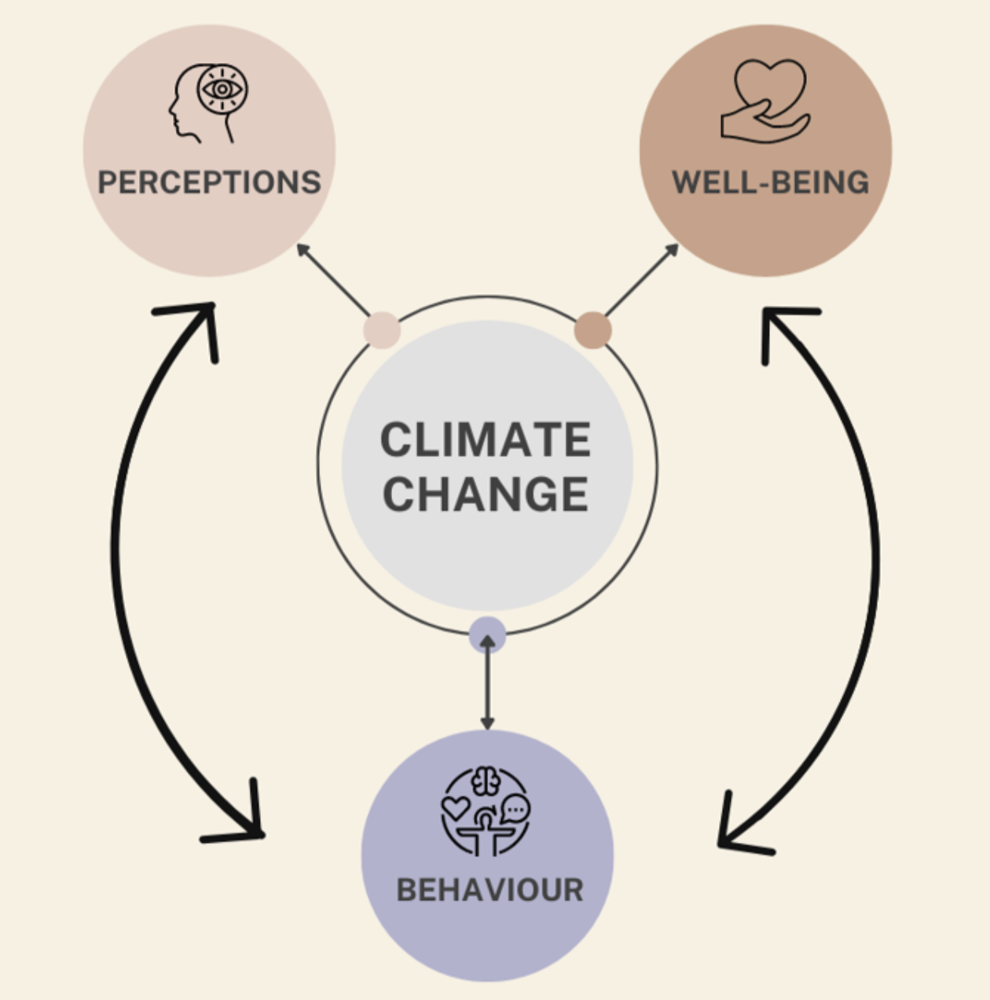
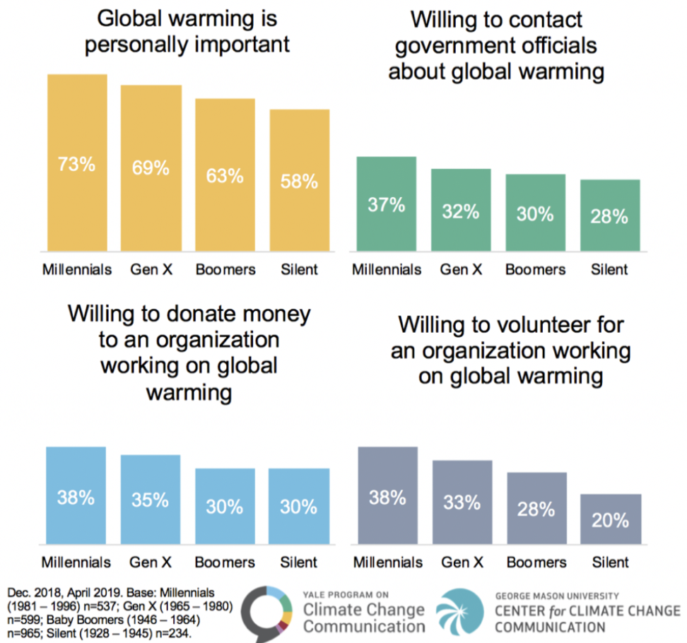

<h1>The Psychology of Climate Denial, Inaction, and Action</h1>

<h2>Public Summary</h2>

Rith Bal, Kiran Maheswaran, Maya Mattar, Michelle Rudner

iSci 3A12, Fall 2022

  

## Introduction
Climate change has emerged as one of the dire issues of contemporary society. As the natural sciences form a consensus on the correlation between anthropogenic activity and climate change, the field of climate psychology has become far more relevant to elucidate human perceptions related to climate change. In this study, we set out to understand the behavioural-, perception-, and mindset-based precursors that contribute to climate denial, action, or inaction (Figure 1). By creating an awareness surrounding these forces, we can inform individuals on the most appropriate ways to promote more environmentally-conscious behaviour in their communities. 

  <i> Figure 1: A graphic illustrating the connections between human cognition and climate change. Human interactions with climate change are facilitated by social groups, governmental legislation, and various organisational policies. Beginning from the upper left, we first notice that the larger and more observable shift of climate change dictates public and personal perceptions of this process. Our perceptions are altered by and influence human behaviours to mitigate or exacerbate climate change, hence a bidirectional arrow. In turn, our behaviours impact and are impacted by our affective well-being with respect to climate changes. Finally, recognizable climate change indicators shape how humans’ internal health and well-being fare, and whether those mental conditions will compel us to act (adapted from Clayton, et al., 2015). </i>

## Inside a Denier’s Mind
Most climatologists agree that climate change is real, human-caused, and poses serious risk—so why do some people still deny these claims? In Canada, 12% of a surveyed population did not believe that humans are causing climate change, while 2-3% rejected climate change altogether (Boulianne and Belland, 2022). Since climate change is complex and constantly escalating, denial may be a coping mechanism to avoid facing this overwhelming problem (Friedrichs, 2011). Denial also helps people maintain a cohesive worldview when presented with conflicting attitudes (Grušovnik, 2012). For example, someone who enjoys frequent airplane trips might feel uncomfortable knowing that this causes major pollution, so the easiest thing to do is deny that fact instead of changing habits. Denial is short-term bliss, but staying in denial wastes time that could be spent mitigating climate damage. 

## Turning Inaction Into Action
Many individuals believe climate change is an issue, yet refuse to act (Figure 2). This is attributed to multiple psychological factors, three of which are discussed. The first is temporal discounting—where immediate rewards are seen as more valuable than future rewards (Duan et al., 2017). To overcome climate-related temporal discounting, climate messaging should emphasise the benefits of choosing environmentally-friendly options, even if it has a delayed reward (Radu, et al., 2011). For example, the initial costs of electric vehicles (EV) dissuade individuals from purchasing them, however if EVs were advertised that the lifetime cost of EVs is cheaper than gas cars (US EPA, 2021), it might encourage EV purchases because individuals receive the immediate benefit of a car and a later benefit of more money. People are more likely to act on environmentally-friendly choices when they feel they benefit personally. 

<i>Figure 2: These four graphs show the distinct climate-related opinions of American citizens from different generations. This data was collected through the Center for Climate Change Communication’s 2018 and 2019 surveys. As seen, more than half of individuals view global warming as personally important, yet less than half are willing to engage in actions that would mitigate climate change impact. It can also be seen that the older a generation is, the less willing they are to have climate-oriented opinions and take action (Bailey, et al., 2019).</i>

 

Second, people assimilate to beliefs and actions of those around them (Barnett, et al., 2021). If those around an individual do not act, it is unlikely the individual will. To encourage a group to act, one option is having a trusted group member share and encourage environmentally-friendly actions because groups are more receptive to their own members than outsiders (Schultz and Fielding, 2014). 

Third, the issue of climate change is too large for any one person to solve, causing individuals to feel too overwhelmed to act. To overcome this, climate messages should present achievable goals which help people gain confidence in their ability to fight climate change (Lauren, et al., 2016). 

## Conclusion
With these barriers to climate action in mind, climate messaging should communicate actionable strategies to the public that also provide personal benefits when possible. This messaging strategy is recommended to eliminate the need for denial and bridge the divide between inaction and action. In addition to psychological research, interdisciplinary collaboration among climate scientists is crucial to mitigate the impact of climate change. A deeper understanding of the psychological factors behind climate denial, inaction, and action can provide the necessary insight to correcting human behaviour for a more sustainable tomorrow. 

## References
Barnett, J., Graham, S., Quinn, T., Adger, W.N. and Butler, C., 2021. Three ways social identity shapes climate change adaptation. Environmental Research Letters, 16(12), pp.1-8. https://doi.org/10.1088/1748-9326/ac36f7.

Boulianne, S. and Belland, S., 2022. Climate denial in Canada and the United States. Canadian Review of Sociology/Revue canadienne de sociologie, 59(3), pp.369–394. https://doi.org/10.1111/cars.12388.

Clayton, S., Devine-Wright, P., Stern, P.C., Whitmarsh, L., Carrico, A., Steg, L., Swim, J. and Bonnes, M., 2015. Psychological research and global climate change. Nature Climate Change, 5(7), pp.640–646. https://doi.org/10.1038/nclimate2622.

Duan, J., Wu, S.J. and Sun, L., 2017. Do the Powerful Discount the Future Less? The Effects of Power on Temporal Discounting. Frontiers in Psychology, 8, p.1-11. https://doi.org/10.3389/fpsyg.2017.01007.

Friedrichs, J., 2011. Peak energy and climate change: The double bind of post-normal science. Futures, 43(4), pp.469–477. https://doi.org/10.1016/j.futures.2010.12.004.

Grušovnik, T., 2012. Environmental Denial: Why We Fail to Change Our Environmentally Damaging Practices. Synthesis philosophica, 27(1), pp.91–106. Available at: <https://hrcak.srce.hr/clanak/139410> [Accessed 20 October 2022]. 

Lauren, N., Fielding, K.S., Smith, L. and Louis, W.R., 2016. You did, so you can and you will: Self-efficacy as a mediator of spillover from easy to more difficult pro-environmental behaviour. Journal of Environmental Psychology, 48, pp.191–199. https://doi.org/10.1016/j.jenvp.2016.10.004.

Radu, P.T., Yi, R., Bickel, W.K., Gross, J.J. and McClure, S.M., 2011. A Mechanism for Reducing Delay Discounting by Altering Temporal Attention. Journal of the Experimental Analysis of Behavior, 96(3), pp.363–385. https://doi.org/10.1901/jeab.2011.96-363.

Schultz, T. and Fielding, K., 2014. The common in-group identity model enhances communication about recycled water. Journal of Environmental Psychology, 40, pp.296–305. https://doi.org/10.1016/j.jenvp.2014.07.006.

US EPA, O., 2021. Electric Vehicle Myths. Green Vehicle Guide. Available at: <https://www.epa.gov/greenvehicles/electric-vehicle-myths> [Accessed 9 November 2022].
